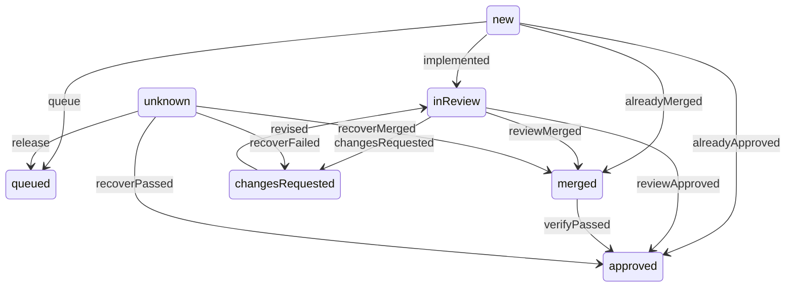

<!-- GENERATED by scripts/docs/generate-lifecycle.mjs from src/lifecycle.ts and src/adapters.ts. Do not edit by hand: run `npm run build && npm run docs:generate`. -->

# The Foreman lifecycle

Every work item moves through one state machine, `src/lifecycle.ts`. The orchestrator never names
a state change itself: it calls `advance(item, "<move>")` (`src/work-source.ts`), which looks the
move up in the table below and emits one `transition` event. Everything else it reports is an
event too, through the same `emit()`.

Each event goes to two kinds of listener, and neither reads the other:

- **The work source** (`WorkSourceAdapter.record`) — today GitHub issues (`src/github-work-source.ts`),
  which turns each move into exactly one `gh issue edit` of lifecycle labels. Other events write nothing there.
- **Observers** (`WorkObserver.onEvent`) — optional plugins, queued and best-effort: the Paperclip
  board mirror (`src/paperclip/`, on when `paperclip.enabled`) and the daemon's activity log. An
  observer that fails or hangs never stops the Foreman.

So the core calls one interface; GitHub is updated, and Paperclip too when it is enabled.

## Stages

Where an item can be. The `…ing` stages exist only while a session runs.

| Stage | Meaning |
|---|---|
| `approved` | Authorized and waiting to be built (or queued behind an open feature PR). |
| `implementing` | An implement session is building it. |
| `inReview` | Its PR is open and waiting for review. |
| `reviewing` | A review session is reviewing its PR. |
| `changesRequested` | The review asked for changes, or CI bounced the PR; waiting to be revised. |
| `revising` | A revise session is addressing the review. |
| `merged` | Merged to the base branch; waiting for dev verification. |
| `verifying` | A verify session is checking it in dev. |
| `pendingVerification` | Approved (verified, or merged with no verify stage); waiting for the release gate. |
| `awaitingRelease` | In an open release PR, or marked ready for production. |
| `blocked` | Needs a person: blocked on the source, or the Foreman declined it or ran out of retries. |
| `done` | In production. Closing it is the EM's act after prod verification. |

## Moves

Every state change the Foreman makes. *From* is the state the caller knows the item is in;
`unknown` means the work source reads the item first and changes only what is there (recovery).

| Move | From | To | Stage | When |
|---|---|---|---|---|
| `queue` | new | queued | `approved` | Held behind an open feature PR on the same branch; builds once that PR merges or closes. |
| `implemented` | new | inReview | `inReview` | An implement session (or a reconciliation, or orphan adoption) opened the PR. |
| `alreadyApproved` | new | approved | `pendingVerification` | Implement found the work already merged and there is no verify stage. |
| `alreadyMerged` | new | merged | `merged` | Implement found the work already merged; dev verification is next. |
| `reviewApproved` | inReview | approved | `pendingVerification` | The review approved and merged, and there is no verify stage. |
| `reviewMerged` | inReview | merged | `merged` | The review approved and merged; dev verification is next. |
| `changesRequested` | inReview | changesRequested | `changesRequested` | The review asked for changes, its CI is red, or a stranded changes-requested verdict is caught up. |
| `revised` | changesRequested | inReview | `inReview` | A revise session pushed changes; back to review. |
| `verifyPassed` | merged | approved | `pendingVerification` | Dev verification passed. |
| `recoverPassed` | unknown | approved | `pendingVerification` | Dead-zone recovery: a merged PR left its issue unadvanced, and a fresh verification passed. |
| `recoverFailed` | unknown | changesRequested | `changesRequested` | Dead-zone recovery: a fresh verification failed. |
| `recoverMerged` | unknown | merged | `merged` | Dead-zone recovery with a verify stage: the merge is recorded and verification follows. |
| `release` | unknown | queued | `approved` | An orphan: in review with no open PR; released back to the queue. |

## Sessions

While a session runs it holds its items in a stage; when it ends with nothing newer said, they return to the fallback.

| Session | Holds items in | Falls back to |
|---|---|---|
| implement | `implementing` | `approved` |
| review | `reviewing` | `inReview` |
| verify | `verifying` | `merged` |
| revise | `revising` | `changesRequested` |

## Releases

| Release PR | Leaves its items in |
|---|---|
| open | `awaitingRelease` |
| merged | `done` |
| closed | where they were |

## Events

The full `WorkEvent` contract (`src/adapters.ts`). Only `transition` writes to the work source.

| Event | Meaning |
|---|---|
| `claim` | The Foreman took the item for an implement session. |
| `transition` | A lifecycle move (the table below). `observed: true` when an AI session already wrote the labels itself and the Foreman is only reporting what it saw: the work source does not write again. |
| `prLink` | The item's PR was opened. |
| `blocked` | The Foreman stopped and needs a person (the reason says why). |
| `unblocked` | A check resolved an earlier block. |
| `merged` | The item's PR merged to the base branch. |
| `promoted` | A promotion PR to the production branch now carries the item. |
| `session` | A session (implement, review, verify, revise) started or ended, with the items it held. |
| `waiting` | Items the Foreman is holding, and on what (an occupied branch, a back-off). |
| `release` | A release PR opened, merged or closed, with the items it carries. |
| `promotionStall` | Promotion is stuck (the base branch is ahead of production and nothing is marked ready), or cleared. |
| `backoff` | A daemon-wide pause on an upstream (GitHub rate limit, Claude session limit) began or ended. |
| `snapshot` | After each pass: every open item's stage as the work source sees it, so a plugin can heal drift. |
